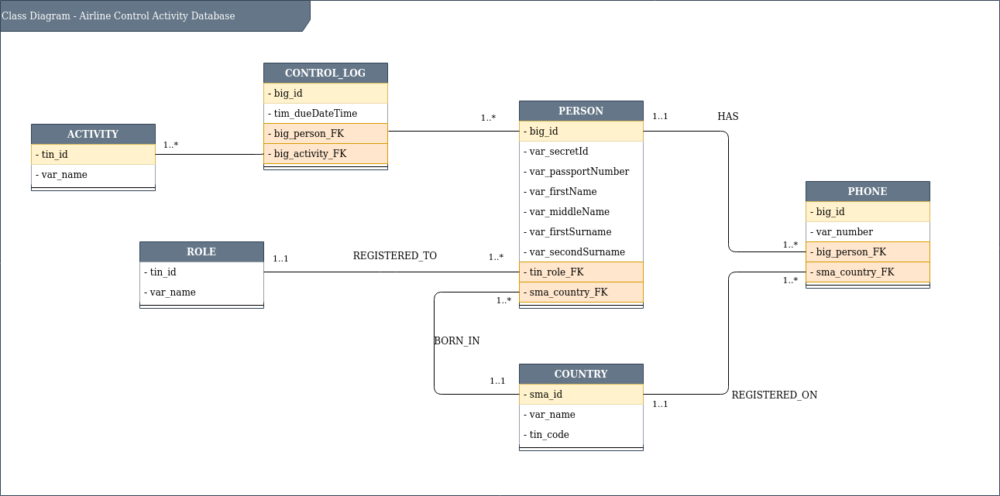

@author mruizq@unah.hn  
@version 1.0.0  
@date 17/10/2021  

# Modulo administrador de Aerolinea

Este modulo forma parte del framework odoo en su versionn 15.0. 

Dentro de este modulo se encuentran herramientas y componentes que permiten la administracion basica de una aerolinea.

 

### Algunas de las operaciones que incluye este modulo son:
* Registro de personas.
* Control de entrada y salida de personas.
  

### Los modelos del modulo se implementaron con base al siguiente diagrama de clases.
 

